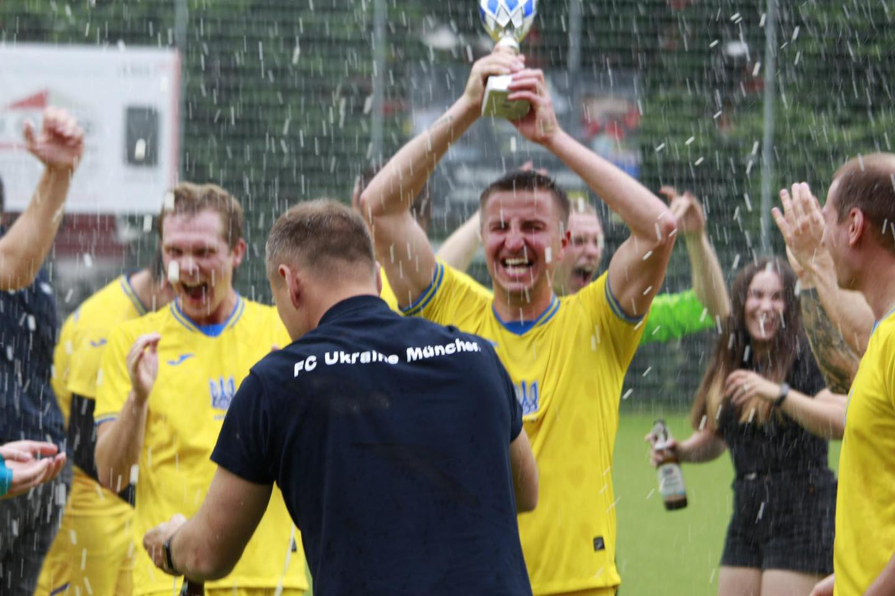
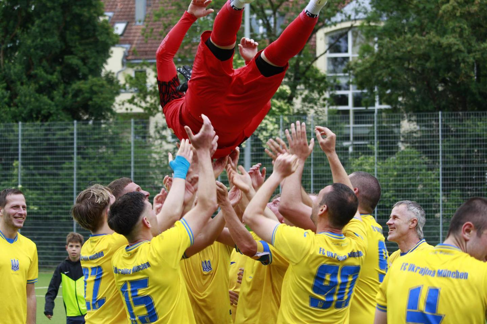

+++
date = '2025-06-16T10:00:00+02:00'
draft = false
title = 'Wir sind MEISTER in unserer Debütsaison 2024/25 in der C-Klasse!!!🏆'
+++

Es war eine schwierige und angespannte Saison bis zum letzten Spiel. Sowohl auf als auch neben dem Fußballplatz wurde viel Mühe investiert. Viele talentierte Spieler und treue Fans haben sich unserem Team angeschlossen. Mit jedem Spiel wurden wir stärker und strebten nach höheren Zielen. Insgesamt haben wir 50 Punkte geholt, 82 Tore geschossen und nur 23 ⚽️ Gegentore kassiert – das sind die besten Werte der Liga💪

Wir danken allen, die uns auf diesem Weg begleitet haben, und allen, die bis zum Schluss bei uns geblieben sind: den Spielern, den Fans und natürlich unseren Sponsoren – K&N Expert, REWE Balagun und Kepler Solar🫶🫶🫶

B-Klasse, warte auf uns – wir kommen für neue Siege! 👊

WIR SIND MEISTER in unserer ersten Saison 2024/25 in der C-Klasse! 🏆
Mit 50 Punkten, 82 Toren und nur 23 Gegentoren – die besten Werte der Liga! 💪
Großer Dank an Spieler, Fans und unsere Sponsoren: K&N Expert, REWE Balagun und Kepler Solar 🫶
B-Klasse, wir kommen – bereit für neue Siege! 👊

[Facebook Post](https://www.facebook.com/FCUkrajinaMuenchen/posts/pfbid0PgMvtZWDUHo4xSBDoSeb1gcuAHFVtt3KyHkARjveqd3afjpV5H7PbrWx9Br87jytl)

[Instagram Post](https://www.instagram.com/p/DKiArEDN5mb/?img_index=4)