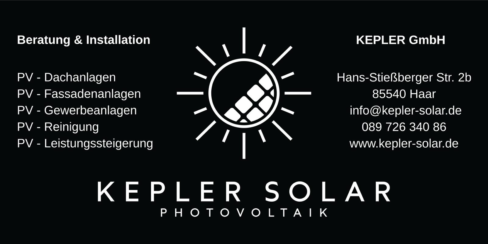
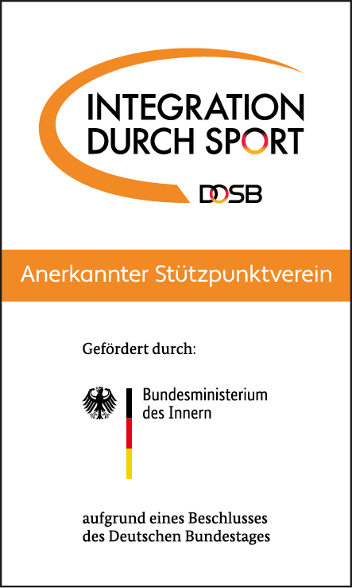
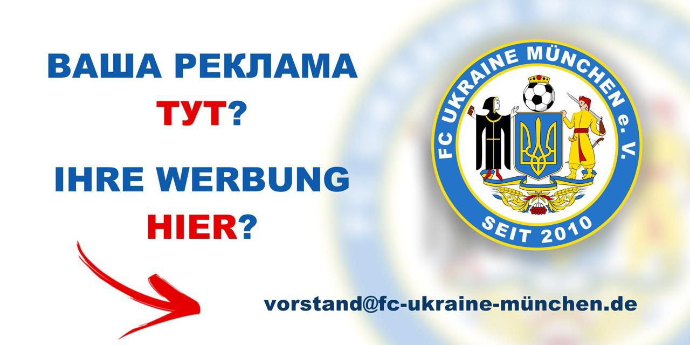

+++
date = '2025-09-16T20:00:00+02:00'
draft = false
title = 'Sponsoren'
+++

Der Fußballverein "FC Ukraine München" bedankt sich herzlich bei unseren treuen
und großzügigen Sponsoren!
Ihre Unterstützung ist für uns von außerordentlicher Bedeutung und ermöglicht es
dem Team zu wachsen, sich zu entwickeln und neue Höhen auf dem Fußballfeld zu
erobern.

Dank Ihrer Hilfe haben wir die Möglichkeit, Trainingseinheiten zu organisieren,
die notwendige Ausrüstung zu beschaffen und die Ukraine in München zu
repräsentieren.
Ihr Glaube an uns inspiriert die Spieler zu neuen Leistungen und hilft uns,
unsere Ziele zu erreichen.

Wir schätzen jeden Einzelnen von Ihnen und hoffen auf eine weiterhin fruchtbare
Zusammenarbeit.
Gemeinsam sind wir stärker!

##### K&N Expert

[Zur Webseite von K&N Expert](https://knexperts.de/)

##### REWE Balagun

[Zur Webseite von REWE Balagun](https://www.rewe.de/marktseite/muenchen/440983/rewe-markt-hermann-weinhauser-strasse-90/)

##### Kepler Solar

[Zur Webseite von Kepler Solar](https://kepler-solar.de)

##### Autohaus Karlsfeld

🚘⚽ AUTOHAUS KARLSFELD - ZUVERLÄSSIGER PARTNER FÜR UKRAINER IN DEUTSCHLAND

Wir freuen uns sehr, die ukrainische Fußballmannschaft zu unterstützen und ein Teil unserer ukrainischen Community in Deutschland zu sein! 🇺🇦

Autohaus Karlsfeld ist nicht nur Autoverkauf. Unser Ziel ist es, jedem zu helfen, ein qualitativ hochwertiges, geprüftes Auto ehrlich, transparent und ohne versteckte Kosten zu erwerben.

✅ Autofinanzierung mit einer Laufzeit von 1 bis 7 Jahren  
✅ Zinssätze von 3,99 % bis 5,99 % p.a. mit Anzahlung (abhängig von der Laufzeit: für 1 und 7 Jahre gelten unterschiedliche Sätze)  
✅ 6,99 % p.a. ohne Anzahlung (für die Spieler der Mannschaft beträgt der Satz ohne Anzahlung immer 5,99 %, nicht mehr)  
✅ Wir arbeiten mit Kunden nach § 24 AufenthG sowie mit anderen Aufenthaltstiteln und Staatsangehörigkeiten  
✅ Bearbeitung des Antrags in kürzester Zeit (bis zu 1 Werktag)  
✅ Minimales Paket an Dokumenten, das jeder hat.  

Wir arbeiten nach dem Prinzip: wie für die eigenen Leute.

🔹 Wir wählen das Auto passend zu Ihren Bedürfnissen und Ihrem Budget aus  
🔹 Wir bieten kostenlose Beratung an  
🔹 Wir berechnen keine Gebühren für die Autosuche/-auswahl  
🔹 Wir verlangen keine Gebühr für die Genehmigung der Finanzierung durch die Bank  
🔹 Keine versteckten Gebühren oder Zusatzleistungen  
🔹 Vollständige Begleitung des Geschäfts vom ersten Anruf bis zur Fahrzeugübergabe  

Alle Autos werden vor dem Verkauf einer gründlichen Prüfung unterzogen:

✔ Geprüfte Fahrzeughistorie  
✔ Technische Diagnose  
✔ Servicewartung  
✔ Professionelle Fahrzeugaufbereitung  
✔ 1 Jahr Garantie auf jedes Auto  

Wir verstehen die ukrainische Mentalität gut und wissen, wie wichtig Vertrauen ist. Deshalb gestalten wir unsere Arbeit so offen und ehrlich wie möglich. Für uns ist der Ruf wichtiger als ein einzelner Verkauf.

Wenn Sie ein Auto in Deutschland suchen, eine Finanzierung abschließen oder einfach nur eine Beratung erhalten möchten, kontaktieren Sie uns. Wir helfen Ihnen gerne weiter und finden die beste Lösung für Sie.

💙💛 AUTOHAUS KARLSFELD  
Zuverlässig • Ehrlich • Menschlich  

🚗 Autoverkauf  
💳 Finanzierung ab 3,99 % p.a.  
🤝 Vollständige Begleitung des Geschäfts  
🇺🇦 Unterstützung für Ukrainer in Deutschland  

🔧 EIGENER SERVICE UND FAHRZEUGSUCHE AUF BESTELLUNG

Autohaus Karlsfeld bietet nicht nur Autoverkauf und Finanzierung.

Wir haben einen eigenen Kfz-Service, in dem unsere Kunden Wartung, Diagnose, Reparaturen und eine vollständige Servicebegleitung für ihr Auto in Anspruch nehmen können.

🚗 Es sind immer geprüfte Fahrzeuge verschiedener Klassen und Preiskategorien auf Lager.

Sollte das gewünschte Auto nicht vorrittig sein, suchen wir es individuell nach Ihrer Anfrage in ganz Deutschland.

Wünschen Sie ein rotes, schwarzes oder blaues Auto? Leder- oder Stoffausstattung? Benzin, Diesel, Hybrid oder Elektro? Eine bestimmte Ausstattung, Motorisierung, Farbe oder ein bestimmtes Budget?

Wir finden genau das Auto, das Sie suchen.

Dank eines breiten Netzwerks an Partnern, offiziellen Händlern und Autoauktionen in ganz Deutschland können wir fast jedes auf dem deutschen Markt vertretene Fahrzeug für Sie finden.

Unsere Aufgabe ist es nicht, das zu verkaufen, was auf dem Hof steht, sondern dem Kunden zu helfen, genau das Auto zu finden, das seinen Wünschen entspricht.

📱 UNSERE KONTAKTE

- 📍 Autohaus Karlsfeld: [Münchner Str. 212, 85757 Karlsfeld](https://maps.app.goo.gl/heq4DtNCJaS1FRE9A)
- 💬 Telegram: [avtokredit_deuschland](https://t.me/avtokredit_deuschland)
- 📸 Instagram: [@autohaus_karlsfeld_official](https://www.instagram.com/autohaus_karlsfeld_official)
- 🎥 TikTok: [@autohaus_karlsfeld](https://www.tiktok.com/@autohaus_karlsfeld)
- 📞 [+49 176 31022079](tel:+4917631022079) (Yuriy)
- 📞 [+49 1516 7681074](tel:+4915167681074) (Oleksiy)

Schreiben Sie uns auf Telegram, Instagram oder WhatsApp, und wir beantworten alle Ihre Fragen und helfen Ihnen, die beste Option für Sie zu finden.

💙💛 Autohaus Karlsfeld - Autos, Finanzierung und Service auf Augenhöhe.

##### Integration durch Sport

Das Bundesprogramm „Integration durch Sport“ (IdS) des Deutschen Olympischen Sportbundes (DOSB) unterstützt Sportvereine, die sich aktiv für die Integration von Menschen mit Migrationshintergrund und Geflüchteten einsetzen. Das Programm wird durch das Bundesministerium des Innern und für Heimat (BMI) sowie das Bundesamt für Migration und Flüchtlinge (BAMF) gefördert. Es stärkt den gesellschaftlichen Zusammenhalt und die interkulturelle Öffnung im Sport.

[Zur Webseite von Integration durch Sport](https://integration.dosb.de)

##### Werden Sie Teil unserer Geschichte!

Der Fußballverein "FC Ukraine München" lädt neue Sponsoren ein!
Ihre Unterstützung wird uns helfen, neue Höhen zu erreichen.
Dies ist eine großartige Gelegenheit, Ihre Marke zu fördern und talentierte
Spieler zu unterstützen.

Kontaktieren Sie uns, um mehr zu erfahren!

