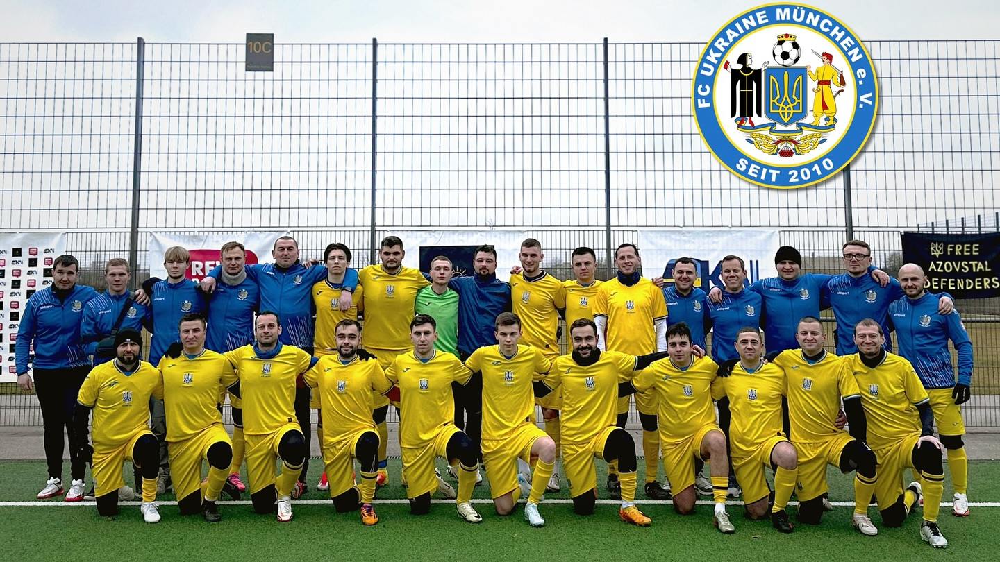

# FC Ukraine München e.V.

*FC Ukraine München e.V.* - офіційно зареєстрований український футбольний клуб
у Німеччині, заснований у 2010 році.
Ми граємо, об’єднуємо українців та підтримуємо Україну!

Маємо дві команди: перша виступає в [Баварському футбольному союзі (BFV)](https://www.bfv.de/mannschaften/fc-ukraine-muenchen/02Q41B242K000000VS5489B1VTILVS2U),
а друга є учасником [Королівської баварської ліги (RBL)](https://royalbavarianliga.de/teaminfo.php?teamid=o2189).
До 2025 року, перша команда [виступала](https://royalbavarianliga.de/teaminfo.php?teamid=m760) також в Королівській баварській лізі (RBL).

Слідкуйте за нашими матчами, ініціативами та доєднуйтесь до команди!

- - -

## ОСТАННІ НОВИНИ
