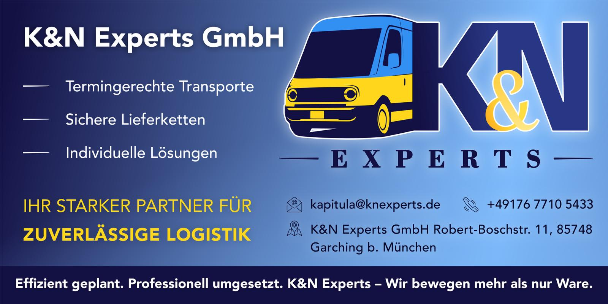
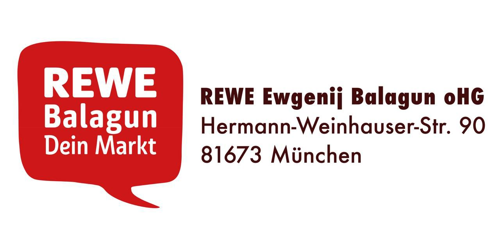
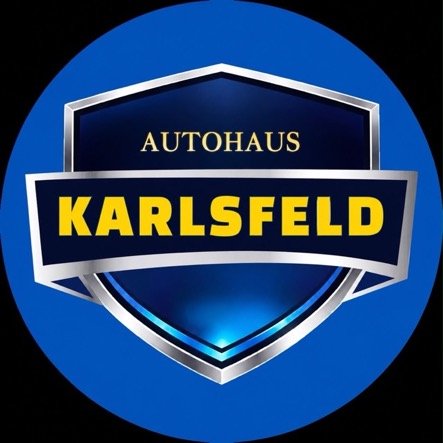

+++
date = '2025-06-16T20:00:00+02:00'
draft = false
title = 'Партнери'
+++

Футбольний клуб "FC Ukraine München" висловлює величезну подяку нашим незмінним
та щедрим партнерам!
Ваша підтримка є надзвичайно важливою для нас і дозволяє команді рости,
розвиватися та підкорювати нові вершини на футбольному полі.

Завдяки вашій допомозі, ми маємо можливість забезпечувати тренування, купувати
необхідне спорядження та представляти Україну в Мюнхені.
Ваша віра в нас надихає гравців на нові звершення та допомагає нам досягати
поставлених цілей.

Ми цінуємо кожного з вас і сподіваємося на подальшу плідну співпрацю.
Разом ми сильніші!

##### K&N Expert

[Відвідайте веб-сайт K&N Expert](https://knexperts.de/)

##### REWE Balagun

[Відвідайте веб-сайт REWE Balagun](https://www.rewe.de/marktseite/muenchen/440983/rewe-markt-hermann-weinhauser-strasse-90/)

##### Kepler Solar

[Відвідайте веб-сайт Kepler Solar](https://kepler-solar.de)

##### Autohaus Karlsfeld

🚘⚽ AUTOHAUS KARLSFELD - НАДІЙНИЙ ПАРТНЕР УКРАЇНЦІВ У НІМЕЧЧИНІ

Ми раді підтримувати українську футбольну команду та бути частиною нашої української спільноти в Німеччині! 🇺🇦

Autohaus Karlsfeld - це не просто продаж автомобілів. Наша мета допомогти кожному придбати якісний, перевірений автомобіль чесно, прозоро та без прихованих платежів.

✅ Фінансування автомобілів терміном від 1 до 7 років  
✅ Відсоткові ставки від 3,99% до 5,99% річних за умови першого внеску (залежно від строку фінансування: для 1 та 7 років діють різні ставки)  
✅ 6,99% річних без першого внеску (для гравців команди ставка без першого внеску завжди становить 5,99%, не більше)  
✅ Працюємо з клієнтами за §24, а також з іншими видами посвідки на проживання та громадянством  
✅ Розгляд заявки у найкоротші терміни (до 1 робочого дня)  
✅ Мінімальний пакет документів, який має кожен.  

Ми працюємо за принципом: як для своїх.

🔹 Підбираємо автомобіль відповідно до ваших потреб і бюджету  
🔹 Надаємо безкоштовні консультації  
🔹 Не беремо оплату за підбір автомобіля  
🔹 Не беремо оплату за погодження фінансування банком  
🔹 Не нав’язуємо прихованих комісій та додаткових послуг  
🔹 Повністю супроводжуємо угоду від першого дзвінка до отримання автомобіля  

Усі автомобілі проходять ретельну перевірку перед продажем:

✔ Перевірена історія автомобіля  
✔ Технічна діагностика  
✔ Сервісне обслуговування  
✔ Професійна підготовка автомобіля  
✔ Гарантія 1 рік на кожен автомобіль  

Ми добре розуміємо український менталітет і знаємо, наскільки важливою є довіра. Саме тому будуємо свою роботу максимально відкрито та чесно. Для нас репутація важливіша за одну продажу.

Якщо ви шукаєте автомобіль у Німеччині, хочете оформити фінансування або просто отримати консультацію звертайтеся до нас. Ми завжди підкажемо, допоможемо та знайдемо найкраще рішення саме для вас.

💙💛 AUTOHAUS KARLSFELD  
Надійно • Чесно • По-людськи  

🚗 Продаж автомобілів  
💳 Фінансування від 3,99% річних  
🤝 Повний супровід угоди  
🇺🇦 Підтримка українців у Німеччині  

🔧 ВЛАСНИЙ СЕРВІС І ПІДБІР АВТОМОБІЛІВ ПІД ЗАМОВЛЕННЯ

Autohaus Karlsfeld -  це не лише продаж автомобілів та фінансування.

Ми маємо власний автосервіс, де наші клієнти можуть проходити технічне обслуговування, діагностику, ремонт і повне сервісне супроводження свого автомобіля.

🚗 У наявності завжди є перевірені автомобілі різних класів і цінових категорій.

Якщо потрібного автомобіля немає в наявності - ми підберемо його індивідуально під ваш запит по всій Німеччині.

Бажаєте червоний, чорний чи синій автомобіль? Шкіряний чи тканинний салон? Бензиновий, дизельний, гібридний або електричний? Певну комплектацію, двигун, колір чи бюджет?

Ми знайдемо саме той автомобіль, який потрібен саме вам.

Завдяки широкій мережі партнерів, офіційних дилерів та автомобільних аукціонів по всій Німеччині ми можемо підібрати практично будь-який автомобіль, який представлений на німецькому ринку.

Наше завдання - не продати те, що є на майданчику, а допомогти клієнту знайти саме той автомобіль, який повністю відповідатиме його побажанням.

📱 НАШІ КОНТАКТИ

- 📍 Autohaus Karlsfeld: [Münchner Str. 212, 85757 Karlsfeld](https://maps.app.goo.gl/heq4DtNCJaS1FRE9A)
- 💬 Telegram: [avtokredit_deuschland](https://t.me/avtokredit_deuschland)
- 📸 Instagram: [@autohaus_karlsfeld_official](https://www.instagram.com/autohaus_karlsfeld_official)
- 🎥 TikTok: [@autohaus_karlsfeld](https://www.tiktok.com/@autohaus_karlsfeld)
- 📞 [+49 176 31022079](tel:+4917631022079) (Юрій)
- 📞 [+49 1516 7681074](tel:+4915167681074) (Олексій)

Напишіть нам у Telegram, Instagram або WhatsApp і ми відповімо на всі ваші запитання та допоможемо підібрати найкращий варіант саме для вас.

💙💛 Autohaus Karlsfeld - автомобілі, фінансування та сервіс по-людськи.

##### Integration durch Sport

Федеральна програма „Integration durch Sport“ (IdS) Німецького олімпійського спортивного союзу (DOSB) підтримує спортивні клуби, які активно працюють над інтеграцією людей з міграційним минулим та біженців. Програма фінансується Федеральним міністерством внутрішніх справ та батьківщини (BMI), а також Федеральним відомством у справах міграції та біженців (BAMF). Вона сприяє зміцненню суспільної згуртованості та міжкультурної відкритості у спорті.

[Відвідайте веб-сайт Integration durch Sport](https://integration.dosb.de)

##### Станьте частиною нашої історії!

Футбольний клуб "FC Ukraine München" запрошує нових партнерів!
Ваша підтримка допоможе нам досягати нових вершин.
Це чудова можливість для просування вашого бренду та підтримки талановитих
гравців.

Зв'яжіться з нами, щоб дізнатися більше!

