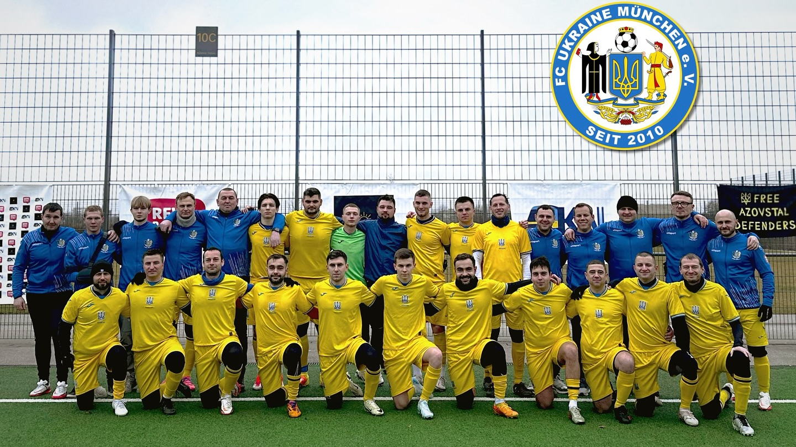

+++
date = '2026-07-09T11:55:19+02:00'
draft = false
title = 'Ми – FC Ukraine München e.V.'
+++

FC Ukraine München e.V. - це український футбольний клуб у Мюнхені, який став не лише спортивною командою, а й важливим осередком української громади в Німеччині. Клуб був заснований у 2010 році, а його головна мета - об’єднувати українців через футбол, підтримувати новоприбулих та популяризувати українську культуру за кордоном.

## Історія клубу

Ідея створення клубу виникла серед українців, які проживали в Мюнхені та хотіли мати власну футбольну команду й місце для спілкування. З роками FC Ukraine München перетворився на справжню футбольну спільноту, де грають українці різного віку та професій.

Особливо важливу роль клуб почав відігравати після повномасштабного вторгнення Росії в Україну у 2022 році. Для багатьох біженців команда стала місцем підтримки, адаптації та нових знайомств.

У німецькому футбольному середовищі клуб офіційно зареєстрований як спортивне товариство.

## Команди та виступи

Сьогодні клуб має три команди:

* [першу команду](https://www.bfv.de/mannschaften/fc-ukraine-muenchen/02Q41B242K000000VS5489B1VTILVS2U), яка виступає під егідою Баварського футбольного союзу (BFV) і вже другий рік поспіль підвищується у класі;
* [другу команду](https://www.bfv.de/mannschaften/fc-ukraine-muenchen/02TCEPR1QC000000VS5489BSVV9JRPRB), яка в свій перший сезон змогла підвищитись у класі;
* та [команду «Alte Herren» (гравці віком 30+)](https://royalbavarianliga.de/teaminfo.php?teamid=o2189), що бере участь у Royal Bavarian Liga (RBL) (AZ-Cup, Ü30-Cup).

### 2025/26: Подвійне підвищення

Сезон 2025/26 став для наших команд теж визначним, оскільки ми зайняли двома командами призові місця і піднялись у A-Klasse i відповідно B-Klasse.

### 2025: Erdinger Meister-Cup

Знаковою подією для клубу стала участь у престижному турнірі Erdinger Meister-Cup — одному з наймасштабніших аматорських футбольних змагань Баварії, яке проводиться під патронатом Баварського футбольного союзу (BFV) та пивоварні Erdinger. Право виступати в цьому турнірі виборюють виключно чемпіони та найсильніші аматорські команди регіону. Для FC Ukraine München це стало важливим визнанням спортивного зростання та чудовою нагодою представити українську спільноту Мюнхена на великій футбольній арені, змагаючись із найсильнішими суперниками Баварії.

### 2024/25: Дебют і чемпіонство

Сезон 2024/25 став історичним для клубу: FC Ukraine München виграв свою дебютну кампанію у C-Klasse, здобувши чемпіонство. Команда набрала 50 очок, забила 82 голи та пропустила лише 23 м’ячі - це були найкращі показники ліги.

Також клуб швидко заявив про себе в офіційних змаганнях BFV. У матеріалах німецьких футбольних медіа зазначалося, що команда одразу після старту в офіційному чемпіонаті змогла піднятися до B-Klasse.

### 2024: Фінал RBL AZ-Cup

Окремою важливою сторінкою в історії FC Ukraine München став вихід команди до фіналу кубка AZ (Abendzeitung Cup) у рамках Royal Bavarian Liga. Для української команди це був знаковий момент, адже участь у фіналі одного з найвідоміших аматорських турнірів Мюнхена показала, що клуб здатний конкурувати на високому рівні навіть серед досвідчених баварських команд. Матч привернув увагу місцевих спортивних медіа та став ще одним доказом того, що FC Ukraine München поступово перетворюється на помітну силу в аматорському футболі Мюнхена.

## Не лише футбол

FC Ukraine München позиціонує себе не просто як спортивний клуб, а як центр української єдності. «Ми граємо, об’єднуємо українців та підтримуємо Україну».

Команда регулярно організовує:

* тренування для нових гравців;
* благодійні ініціативи;
* зустрічі української громади;
* допомогу новоприбулим українцям у Німеччині.

Тренування проходять у західній частині Мюнхена кілька разів на тиждень, а клуб постійно запрошує нових учасників - від молодих футболістів до досвідчених гравців категорії «Alte Herren» (30+).

## Значення для українців у Німеччині

FC Ukraine München став прикладом того, як спорт може допомагати людям під час війни та еміграції. Для багатьох українців клуб став «другим домом», де можна знайти друзів, підтримку та відчути зв’язок із Батьківщиною навіть далеко від України. Німецькі спортивні видання називали команду місцем, де «ніхто не залишається сам».

FC Ukraine München e.V. запрошує гравців, спонсорів та всіх любителів футболу у свої лави.

Приєднуйтесь до нашої родини та ставайте частиною команди!

