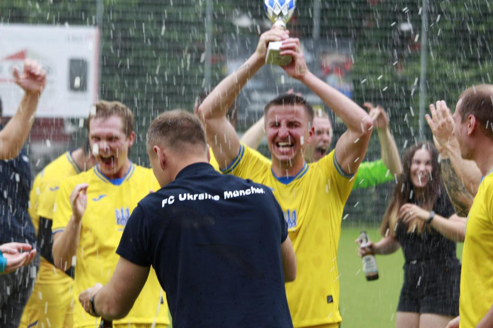
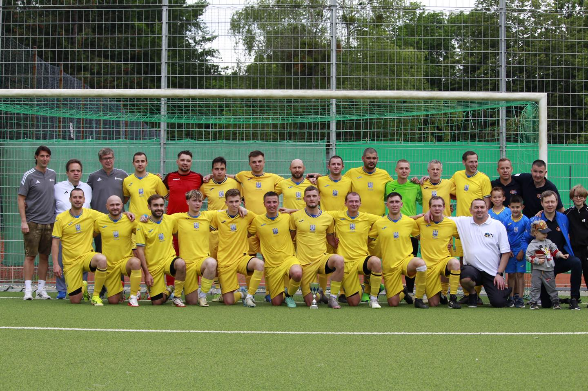
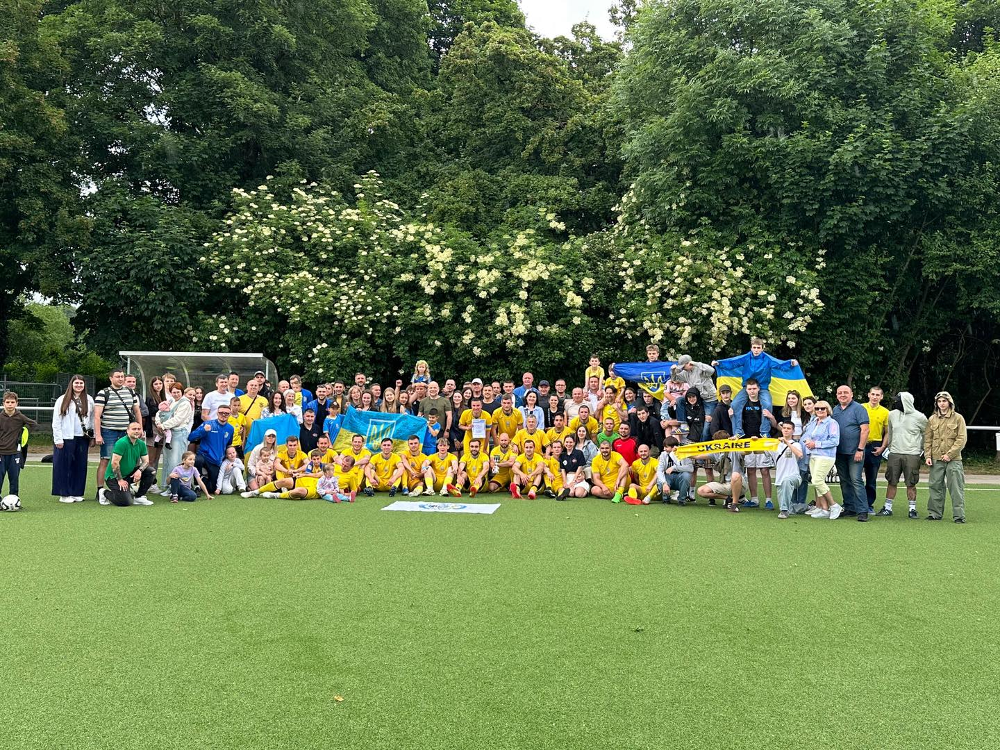

+++
date = '2025-06-16T10:00:00+02:00'
draft = false
title = 'Ми – ЧЕМПІОНИ у нашому дебютному сезоні 2024/25 у C-Klasse!!!🏆'
+++

Це був складний та напружений сезон до останнього матчу. Дуже багато докладено зусиль як на футбольному полі, так і за його межами. До нашої команди долучилося багато талановитих гравців та відданих уболівальників. З кожною грою ми міцнішали й прагнули ще вищих цілей. Загалом здобули 50 залікових очок, забили 82 голи, лише 23 ⚽️ пропустили – що є найкращими показниками ліги💪

Ми вдячні всім, хто був з нами на цьому шляху, та всім, хто залишився з нами докінця: гравцям, вболівальникам і, звісно, нашим спонсорам – K&N Expert, REWE Balagun та Kepler Solar🫶🫶🫶

B-klasse, чекай на нас – ми йдемо за новими перемогами! 👊

WIR SIND MEISTER in unserer ersten Saison 2024/25 in der C-Klasse! 🏆
Mit 50 Punkten, 82 Toren und nur 23 Gegentoren – die besten Werte der Liga! 💪
Großer Dank an Spieler, Fans und unsere Sponsoren: K&N Expert, REWE Balagun und Kepler Solar 🫶
B-Klasse, wir kommen – bereit für neue Siege! 👊

[Пост у Facebook](https://www.facebook.com/FCUkrajinaMuenchen/posts/pfbid0PgMvtZWDUHo4xSBDoSeb1gcuAHFVtt3KyHkARjveqd3afjpV5H7PbrWx9Br87jytl)

[Пост в Instagram](https://www.instagram.com/p/DKiArEDN5mb/?img_index=4)
